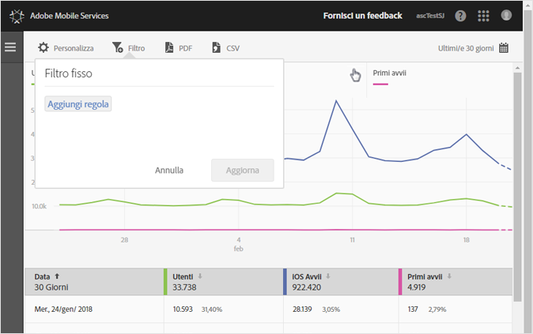
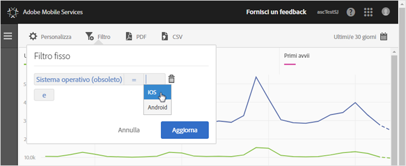
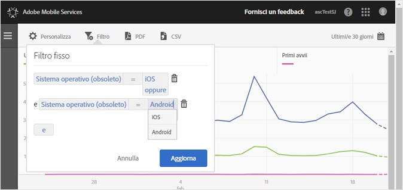

# Aggiungere un filtro fisso {#add-sticky-filter}

Crea un filtro per più rapporti in modo da visualizzare il comportamento di un segmento in tutti i rapporti mobili. Un filtro fisso consente di definire un filtro applicato a tutti i rapporti non di percorso.

Nell’esempio seguente vengono aggiunti dei filtri fissi per i sistemi operativi iOS e Android al rapporto **[!UICONTROL Utenti e sessioni]**, ma le istruzioni sono valide per qualsiasi rapporto o metrica.

1. Fai clic sull’icona **[!UICONTROL Filtro]** nella parte superiore di qualsiasi rapporto in Adobe Mobile.

   

1. Nella finestra di dialogo Filtro fisso, fai clic su **[!UICONTROL Aggiungi regola]**, seleziona **[!UICONTROL Sistemi operativi]** e, dall’elenco a discesa, seleziona **[!UICONTROL iOS]**.

   Per aggiungere Android come filtro, ripeti questo passaggio.

   

1. Fai clic su **[!UICONTROL E]**, seleziona **[!UICONTROL Sistema operativo]**, quindi seleziona **[!UICONTROL Android]** dall’elenco a discesa.

   A questo punto i filtri dovrebbero essere come nell’esempio seguente:

   

1. Fai clic su **[!UICONTROL Aggiorna]** ed **[!UICONTROL Esegui]**.
