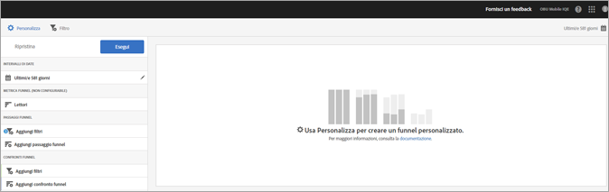
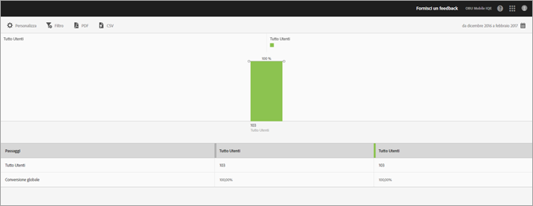

# Rapporto Funnel{#funnel}

{#eol}

Un rapporto **[!UICONTROL Funnel]** indica dove i clienti abbandonano una campagna di marketing o deviano da un percorso di conversione definito durante l’interazione con la tua app mobile. Puoi usare il rapporto **[!UICONTROL funnel]** anche per confrontare le azioni di segmenti diversi.

Grazie alla visibilità delle decisioni dei clienti in ogni fase, puoi comprendere più facilmente in quale momento vengono scoraggiati, che percorso tendono a seguire e quando i clienti abbandonano l’app.

Quando apri il rapporto **[!UICONTROL Funnel]**, devi creare un funnel personalizzato. Per ulteriori informazioni, vedi [Personalizzare i rapporti](/help/using/usage/reports-customize/reports-customize.md).

>[!TIP]
>
>Per salvare il funnel personalizzato, salva l’URL dopo aver configurato le impostazioni ed eseguito il rapporto. Puoi condividere l’URL o salvarlo in un documento.

Ecco un esempio di questo rapporto:

Per illustrare un funnel semplice, ecco le impostazioni per una configurazione che utilizza tre passaggi funnel e due confronti funnel. Supponiamo che un’app in versione demo consenta agli utenti di aggiungere un elemento, ad esempio una foto, e di condividerlo.

Le sezioni della finestra Personalizza indicano che l’utente ha avviato l’app, aggiunto una foto all’app dalla galleria, condiviso una o più foto dall’app tramite social media, messaggi di testo, e-mail e così via. Il confronto funnel ti permette di confrontare i livelli di aggiunta e condivisione delle foto tra utenti dell’app iOS e dell’app Android.

Per generare il rapporto, fai clic su **[!UICONTROL Esegui]**.

Ecco un esempio di rapporto generato:

La prima serie mostra che il 100% degli utenti ha avviato l’app. La seconda serie mostra che una percentuale più elevata di utenti Android ha aggiunto una foto dalla galleria. La terza serie mostra che quasi metà degli utenti iOS ha condiviso la foto, mentre nessuno degli utenti Android lo ha fatto. Questo dato potrebbe indicare un problema dell’app che sarà bene approfondire.

Per visualizzare ulteriori informazioni, passa il mouse su una barra del grafico.

Per questo rapporto puoi configurare le seguenti opzioni:

* **[!UICONTROL Periodo di tempo]**

   Fai clic sull’icona **[!UICONTROL Calendario]** per selezionare un periodo di tempo personalizzato o per sceglierne uno preimpostato dall’elenco a discesa.
* **[!UICONTROL Personalizza]**

   Per personalizzare i rapporti, puoi modificare le opzioni **[!UICONTROL Mostra per]** e aggiungere metriche e filtri, serie (metriche) supplementari e altri elementi. Per ulteriori informazioni, vedi [Personalizzare i rapporti](/help/using/usage/reports-customize/reports-customize.md).
* **[!UICONTROL Filtro]**

   Fai clic su **[!UICONTROL Filtro]** per creare un filtro per più rapporti in modo da visualizzare il comportamento di un segmento in tutti i rapporti mobili. Un filtro fisso consente di definire un filtro applicato a tutti i rapporti non di percorso. Per ulteriori informazioni, consulta [Aggiungere un filtro fisso](/help/using/usage/reports-customize/t-sticky-filter.md).
* **[!UICONTROL Scarica]**

   Fai clic su **[!UICONTROL PDF]** o **[!UICONTROL CSV]** per scaricare o aprire dei documenti e condividerli con utenti che non hanno accesso a Mobile Services oppure per utilizzarli in presentazioni.
