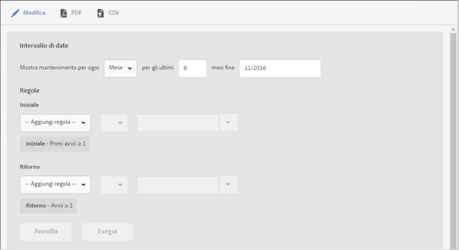

# Rapporto Mantenimento {#retention}

Il rapporto **[!UICONTROL Mantenimento]** (precedentemente denominato First Launch Cohorts, Coorti primo avvio) è un rapporto di coorte che indica quanti utenti univoci hanno avviato la tua app per la prima volta e quindi l’hanno avviata di nuovo almeno una volta nei mesi successivi.

Per impostazione predefinita, questo rapporto mostra il mantenimento di gruppi di utenti in base a quando hanno avviato l’app per la prima volta. Puoi anche personalizzare il rapporto con una metrica diversa da Primo avvio e aggiungere altre azioni.

Una coorte è un gruppo di persone che condividono una caratteristica o un’esperienza comune in un arco di tempo definito. Il rapporto **[!UICONTROL Mantenimento]** considera le caratteristiche comuni degli utenti che hanno installato l’app in un giorno, una settimana o un mese particolare, quindi genera un grafico che illustra quanti di questi utenti hanno avviato l’app negli X giorni, settimane o mesi successivi. Il rapporto fornisce quindi un’indicazione del livello di mantenimento o di coinvolgimento dei visitatori attivi.

Ecco un esempio di questo rapporto:

Nella colonna **[!UICONTROL M0]** è indicato il numero totale di persone che hanno avviato l’app per la prima volta a novembre 2014. La colonna **[!UICONTROL M1]** mostra quante persone hanno avviato nuovamente l’app durante il mese successivo (dicembre 2014), e così via.

Per cambiare l’intervallo di date o modificare le regole del rapporto, fai clic su **[!UICONTROL Modifica]**.

È possibile compilare il rapporto con qualsiasi variabile o metrica, comprese le metriche Ciclo di vita ma escluse le metriche calcolate.
