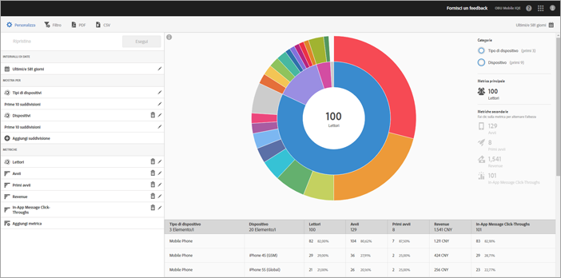

# Rapporto Tecnologia {#technology}

Il rapporto **[!UICONTROL Tecnologia]** permette di vedere i diversi tipi di dispositivi, sistemi operativi e operatori di telefonia mobile su cui viene utilizzata l’app.

Questo rapporto fornisce una visualizzazione sunburst dei dati esistenti; può essere utilizzato per scoprire i segmenti di pubblico (raccolte di visitatori) per il targeting. La creazione e la gestione dei tipi di pubblico è simile alla creazione e all’utilizzo dei segmenti, con la differenza che un pubblico può essere reso disponibile in Experience Cloud.

## Navigazione e utilizzo {#section_83CA60E1AE6245FEBCBFF3205615C4DF}

Questa visualizzazione fornisce, ad esempio, il rapporto di base insieme alle suddivisioni, usa l’altezza per mostrare la metrica in questione e le differenze di prestazioni tra le metriche. Ciascun anello rappresenta un segmento di pubblico nella categoria dell’anello. Puoi intraprendere azioni su un pubblico, quali l’applicazione di un filtro fisso e la visualizzazione di metriche.

>[!TIP]
>
>Oltre a queste informazioni, puoi visualizzare un’esercitazione interna al prodotto che descrive come interagire con un grafico sunburst. Per avviare l’esercitazione, fai clic su **[!UICONTROL Suddivisione tecnologia]** nella barra del titolo del rapporto, poi fai clic su **[!UICONTROL Personalizza]** e infine sull’icona **[!UICONTROL i]**.

Il grafico sunburst è interattivo ed è possibile completare le seguenti attività:

* Passa il cursore sopra una parte del grafico per visualizzare ulteriori informazioni.
* Modifica il periodo temporale facendo clic sull’icona **[!UICONTROL Calendario]**.
* Fai clic su una sezione dell’anello per selezionare il pubblico su cui eseguire azioni quali ingrandire, nascondere alcuni tipi di pubblico, creare un messaggio in-app o un filtro fisso.
* Nell’angolo in alto a destra, seleziona **[!UICONTROL Tipo di dispositivo]** e **[!UICONTROL Dispositivo]** per visualizzare informazioni sui dispositivi e sui tipi di dispositivi.

* Fai clic su una metrica secondaria a destra per aggiungerla alla visualizzazione.

   Puoi visualizzare la metrica secondaria scegliendo un colore, un’altezza o entrambi.

La tabella seguente descrive i rapporti standard e come vengono compilati in Mobile Services:

| Rapporto | Metodo di compilazione | Descrizione |
|--- |--- |--- |
| Dispositivo | Metriche del ciclo di vita | Metriche comuni suddivise per tipo di dispositivo. |
| Sistemi operativi | Automatico | Metriche comuni suddivise per sistema operativo. |
| Versione sistema operativo | Metriche del ciclo di vita | Metriche comuni suddivise per versione del sistema operativo. |
| Gestori | Automatico | Metriche comuni suddivise per gestore. |

>[!TIP]
>
>Nel rapporto **[!UICONTROL Gestori]**, per gli utenti Wi-Fi è riportato il valore `none`.

## Aggiungere suddivisioni e metriche {#section_15833511E82648869E7B1EFC24EF7B82}

Puoi aggiungere suddivisioni e metriche secondarie, che modificano l’altezza di ogni pubblico rispetto ai tipi di pubblico riportati nel grafico.

>[!IMPORTANT]
>
>Più anelli si aggiungono al grafico sunburst, più tempo di elaborazione sarà necessario.

Per aggiungere suddivisioni e metriche secondarie, fai clic su **[!UICONTROL Suddivisione tecnologia]** nella barra del titolo del rapporto, quindi fai clic su **[!UICONTROL Personalizza]**.

Quando fai clic su **[!UICONTROL Aggiungi suddivisione]** o **[!UICONTROL Aggiungi metrica]**, viene visualizzato un nuovo elemento con lo stesso nome di quello precedente nell’elenco. Fai clic sulla suddivisione o metrica appena creata per accedere a un elenco a discesa dal quale selezionare un nuovo elemento.

## Creare un filtro fisso {#section_B4E355CD1FE34E4C8ADC38139ED67FC8}

Fai clic su una sezione dell’anello per selezionare il pubblico per il quale vuoi creare un filtro fisso, quindi fai clic su **[!UICONTROL Filtro fisso]**. Questo filtro consente di applicare i filtri correnti e di eseguire un nuovo rapporto basato sui filtri.

## Condividere i rapporti   {#section_560DD5CED5144249B7E49461E2422100}

Dopo che hai creato un rapporto, le impostazioni vengono utilizzate per creare un URL personalizzato, che puoi copiare e condividere.
