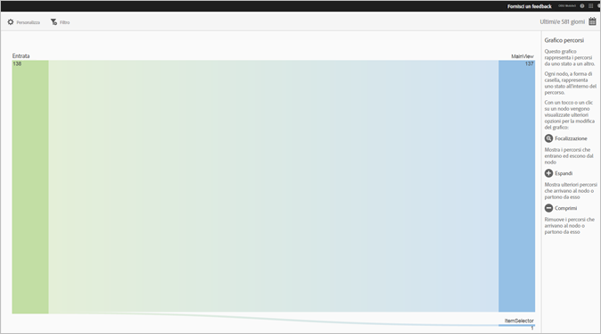
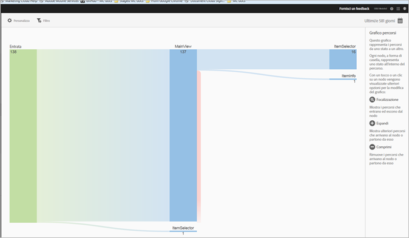
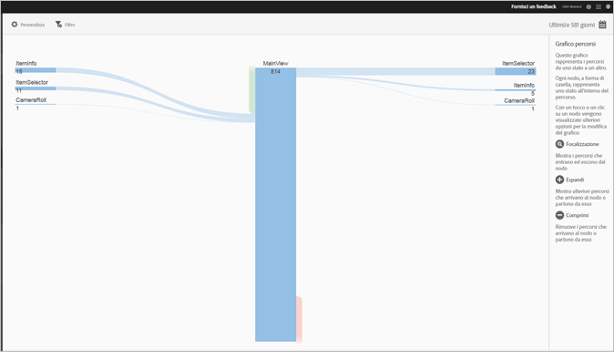
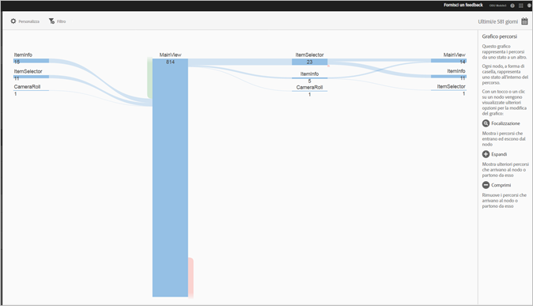

# Visualizzare il rapporto Percorsi {#view-paths}

Il rapporto **[!UICONTROL Percorsi di visualizzazione]**, basato sull’analisi dei percorsi, visualizza un grafico che rappresenta i percorsi seguiti tra gli stati dell’app.

>[!TIP]
>
>I rapporti **[!UICONTROL Percorsi di visualizzazione]** e **[!UICONTROL Percorsi azione]** sono molto simili, in quanto sono entrambi rapporti relativi ai percorsi. Il rapporto **[!UICONTROL Percorsi di visualizzazione]** permette di vedere come gli utenti si spostano nell’app passando da una schermata all’altra. Il rapporto **[!UICONTROL Percorsi azione]** mostra la sequenza di azioni (clic, selezioni, ridimensionamento ecc.) eseguite dagli utenti nell’app. Puoi utilizzare un rapporto funnel per combinare la navigazione e le azioni in un unico rapporto. Per ulteriori informazioni, vedi [Funnel](/help/using/usage/reports-funnel.md).

Ogni nodo, a forma di casella, rappresenta uno stato nei percorsi seguiti dall’utente attraverso un’app. Ad esempio, nell’illustrazione qui sopra, il nodo più in alto rappresenta quanti utenti hanno avviato l’app e poi hanno visualizzato la vista principale.

Quando fai clic su un nodo per visualizzare altre opzioni per la modifica del grafico, vengono visualizzate altre opzioni quali **[!UICONTROL Attiva]** e **[!UICONTROL Espandi]**. Ad esempio, se fai clic sullo stato **[!UICONTROL MainView]** nel nodo principale, diventano visibili le icone **[!UICONTROL Attiva]** ed **[!UICONTROL Espandi]**.

Per espandere la vista, fai clic sull’icona **[!UICONTROL +]** in modo da visualizzare i percorsi aggiuntivi in entrata o in uscita dal nodo. Nell’illustrazione seguente, lo stato 1 è l’avvio dell’app, lo stato 2 è la visualizzazione della pagina principale dell’app e lo stato 3 include i percorsi seguenti che sono stati seguiti dagli utenti:

* Accesso al Rullino foto
* Accesso al selettore di elementi
* Accesso alla fotocamera
* Accesso alla pagina di informazioni sull’elemento

Fai clic sull’ per isolare il nodo e visualizzare i percorsi in entrata e in uscita dal nodo selezionato. Nell’illustrazione seguente, i seguenti percorsi hanno preceduto la visualizzazione della vista principale dell’app da parte degli utenti:

* Informazioni elemento
* Selettore elemento
* Rullino foto
* Fotocamera

Puoi rendere attivi o espandere più nodi per ottenere una vista dettagliata dei percorsi seguiti dagli utenti nell’app. Ad esempio:

Per questo rapporto puoi configurare le seguenti opzioni:

* **[!UICONTROL Periodo di tempo]**
Fai clic sull’icona **[!UICONTROL Calendario]** per selezionare un periodo di tempo personalizzato o per sceglierne uno preimpostato dall’elenco a discesa.
* **[!UICONTROL Personalizza]**
Per personalizzare i rapporti, puoi modificare le opzioni **[!UICONTROL Mostra per]**, aggiungere metriche e filtri, aggiungere serie (metriche) supplementari e altri elementi. Per ulteriori informazioni, vedi [Personalizzare i rapporti](/help/using/usage/reports-customize/reports-customize.md).
* **[!UICONTROL Filtro]**
Fai clic su **[!UICONTROL Filtro]** per creare un filtro per più rapporti in modo da visualizzare il comportamento di un segmento in tutti i rapporti mobili. Un filtro fisso consente di definire un filtro applicato a tutti i rapporti non di percorso. Per ulteriori informazioni, consulta [Aggiungere un filtro fisso](/help/using/usage/reports-customize/t-sticky-filter.md).
* **[!UICONTROL Download]**
Fai clic su **[!UICONTROL PDF]** o **[!UICONTROL CSV]** per scaricare o aprire dei documenti e condividerli con utenti che non hanno accesso a Mobile Services oppure per utilizzarli in presentazioni.