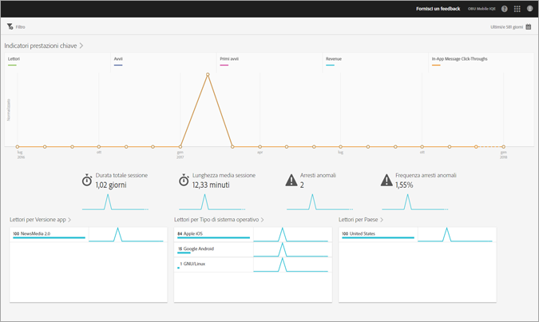

# Report Panoramica{#overview}

Il rapporto Panoramica fornisce un'istantanea delle tue metriche chiave.

Ecco un esempio di questo rapporto:

Puoi modificare l'intervallo di date del rapporto facendo clic sull'icona Calendario in alto a destra. Puoi anche creare un filtro fisso che si estende su più rapporti per visualizzare il comportamento di un segmento in tutti i rapporti mobili. Per ulteriori informazioni sulla creazione di un filtro fisso, consultate [Aggiungere un filtro](/help/using/usage/reports-customize/t-sticky-filter.md)fisso.

>[!TIP]
>
>Puoi configurare le metriche chiave per questo rapporto durante la creazione dell'app. Per ulteriori informazioni, consultate [Configurazione dell'app](/help/using/c-manage-app-settings/c-mob-confg-app/c-mob-confg-app.md).

