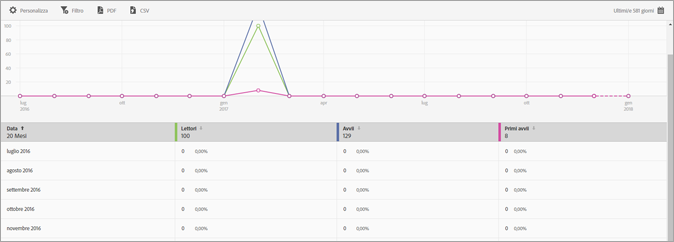

# Rapporto utenti e sessioni{#users-and-sessions}

Il rapporto Utenti e sessioni visualizza le metriche relative ai visitatori unici nell'intervallo di tempo selezionato.

Per questo rapporto puoi configurare le seguenti opzioni:

* **[!UICONTROL Periodo di tempo]**

   Fai clic sull'icona **[!UICONTROL Calendario]per selezionare un periodo di tempo personalizzato o per sceglierne uno preimpostato dall'elenco a discesa.**

* **[!UICONTROL Personalizza]**

   Customize your reports by changing the **[!UICONTROL Show By]** options, adding metrics and filters, and adding additional series (metrics), and more. Per ulteriori informazioni, consultate [Personalizzare i rapporti](/help/using/usage/reports-customize/t-reports-customize.md).

* **[!UICONTROL Filtro]**

   Fai clic su **[!UICONTROL Filtro]per creare un filtro per più rapporti in modo da visualizzare il comportamento di un segmento in tutti i rapporti mobili.** Un filtro fisso consente di definire un filtro applicato a tutti i rapporti non di percorso. Per ulteriori informazioni, consultate [Aggiungere filtri fissi](/help/using/usage/reports-customize/t-sticky-filter.md).

* **[!UICONTROL Scarica]**

   Click **[!UICONTROL PDF]** or **[!UICONTROL CSV]** to download or open documents and share with users who do not have access to Mobile Services or to use the file in presentations.