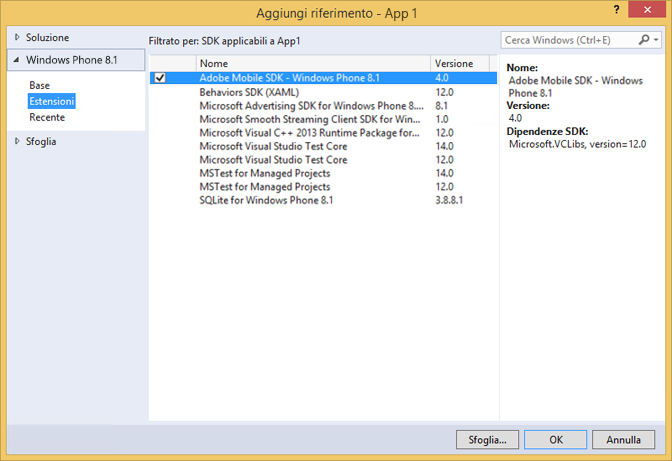

# Windows Visual Studio extensions for Experience Cloud Solutions 4.x SDK {#windows-visual-studio-extensions-for-experience-cloud-solutions-x-sdk}

Queste estensioni offrono un modo molto più semplice di aggiungere il riferimento dell’SDK Windows 4.x delle soluzioni Experience Cloud nel progetto.

## Installare la libreria da github {#section_F55DB6241EF1475286C05FEAEBF996A3}

1. Scarica l’SDK universale Windows da [GitHub](https://github.com/Adobe-Marketing-Cloud/mobile-services/releases).
1. Estrai il file scaricato in locale.
1. Fai doppio clic sul file adbmobilewindowsstorevsix. vsix o adbmobilewindowsphonevsix. vsix per aprire il programma di installazione.

1. Selezionate **[!UICONTROL Posizione globale]** e installate la libreria.

## Add references to your project {#section_00C14FE9243D4330BE1F4BB56FCF08B1}

1. Apri il progetto Windows 8.1 o Windows Phone 8.1.
1. Aprite la finestra di dialogo Gestione riferimento.

   

1. Nella scheda **[!UICONTROL Estensioni]** di Windows 8.1 o Windows Phone 8.1, individua e seleziona **[UICONTROL Adobe Mobile SDK]**.
1. Fai clic su **[!UICONTROL OK]per salvarlo.**

   L'SDK di Adobe Mobile verrà aggiunto al progetto e, se non è già stato aggiunto, viene **[aggiunto anche il]** pacchetto UICONTROL Microsoft Visual C + + Runtime.

1. In Gestione configurazione, selezionate un tipo di piattaforma e iniziate a testare l'app.

